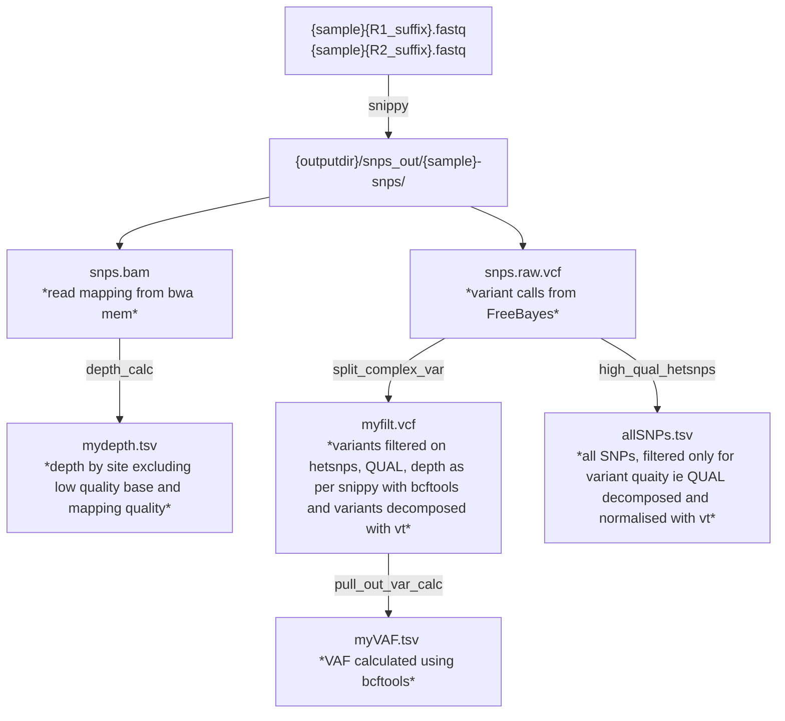
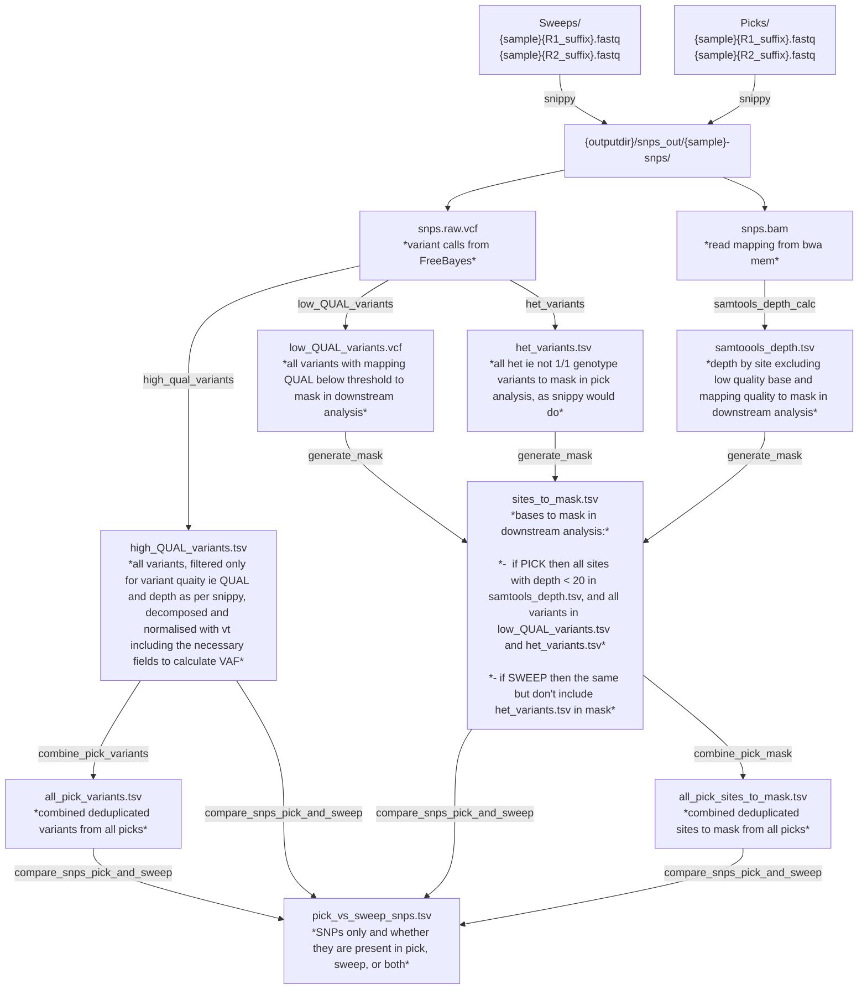

# Running snakemake pipeline

## Put data in the right places

* Read files in `data/`
* the script `data/download_test_files.sh` will use `wget` to download some
DASSIM E. coli reads and a K12 reference for testing if you like

## Run 

`cd snakemake`  
`snakemake -s Snakemake_snippy.smk`  

It uses the `configJL.yaml` file and the data in the `data/` folder - put reads
in here

The `Snakefile` is sarah's full pipeline - fully working on 31/01/2025.

## Overview of pipeline - current pipeline

Reminder

* QUAL - measure of variant quality used by bcftools
* samtools -q is base quality, -Q is mapping quality

## Proposed pipeline

