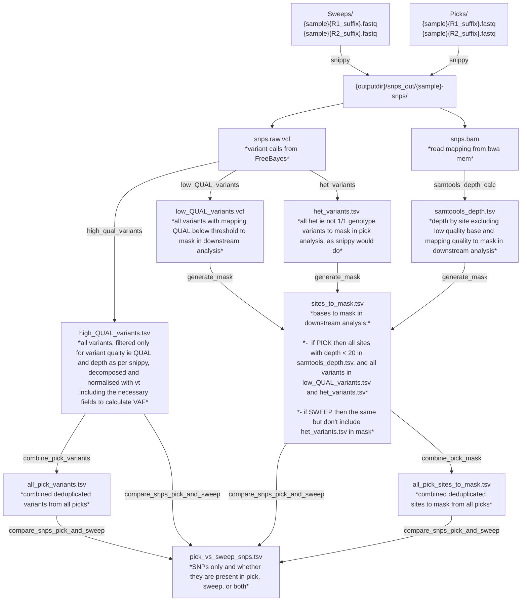

# Running snakemake pipeline

Currently the pipeline takes a folder full of pick reads, a folder full of sweep
reads, assembles them to a reference with snippy. Then uses the bam files to
generate masks for low quality (QUAL) variants, low depth (accounting for poor
quality bases  and mappings) and heterogeneous SNPS (!= "1/1") in bases. It
produces an output tsv with a list of high quality variants that are present is
either picks, sweeps, or both.

## Problems to fix in the pipeline

Use the spike experiments as test data 

* There are SNPs being called between the spike picks (~ 20) which are not
present in the snippy consensus sequences - filtering must be wrong somewhere
* Since implementing depth filter, all the SNPs in the core picks have gone -
which must be wrong as the snippy consensus sequencers show they are there
* Depth fitering in the problematic snps filter isn't adding them to the masks
so would ovecall differences between picks and sweeps (extra SNPs in picks)

What we expect

* ST131 spike - 5 picks with 0 SNPs between 

## Put data in the right places

* Read files in `data/`
* sweeps in `data/sweeps`, picks in `data/picks`

## Run 

`snakemake`  

Reminder

* QUAL - measure of variant quality used by bcftools
* samtools -q is base quality, -Q is mapping quality

## Pipeline overview

