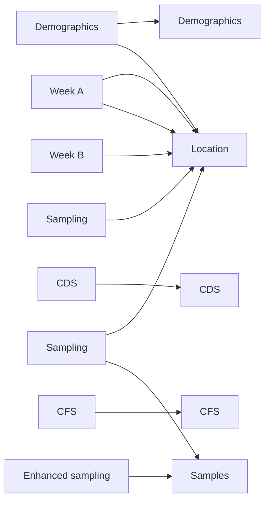

# TRACS database structure and data extraction scripts

The TRACS database structure reflects the sampling but is probably not ideal for
analysis. The sampling and database structure and how that relates to these
scripts is outlined here.

## TRACS sampling structure

* Each location is sampled for two weeks; in the redcap database, this is a
"visit"
* Participants are consented into the study at a baseline redcap event, which includes
  the following forms
    + Demographics
    + Consent infro and CONSULT
    + Consent form 
    + Consultee form
* These forms are only completed once , at recruitment
* At each sampling round (called visit 1 ...5 and eacha redcap event), the following forms are completed:
  + Care dependency score
  + Clinical frailty score
  + Antibiotic exposure (one form for each exposure)
  + Week A (which records location, animal exposure last 3/12, PPI use, travel
  last 3/12), whether samples collected
  + Week B (location, whether week B samples collected)
  + Sample collection (location, sample ID, sample type)
  + End of visit (date of end of visit, whether participant is still there) -
  this is missing for some of the early participants as we hadn't set the form
  up
* A small number of participants underwent enhanced sampling (sample collection
inbetween visits); they had an extra "Enhanced sampling" event with the forms:
  + enhanced sampling (consent etc)
  + sample collection (sample ID and location)

## Data extraction

The aim is to get the data into a number of long-format tables where each table
reflects one aspect of the study. The scripts generate the following data

