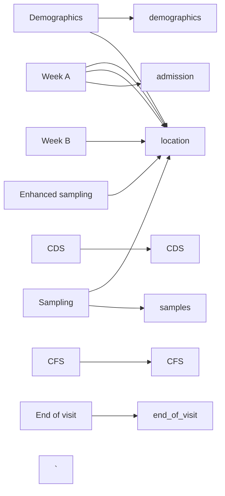

# TRACS database structure and data cleaning strategy

The TRACS database structure reflects the sampling but is probably not ideal for
analysis. The sampling and database structure and how that relates to these
scripts is outlined here. Clincial data is stored in a redcap database and micro
data in excel sheets.

## TRACS redcap sampling structure

* Each location is sampled for two weeks; in the redcap database, this is a
"visit"; participants can be sampled in multiple visits if they are still in the
sampling location,
* Participants are consented into the study at a baseline redcap event, which includes
  the following forms
    + Demographics
    + Consent infro and CONSULT
    + Consent form 
    + Consultee form
* These forms are only completed once , at recruitment
* At each sampling round (called visit 1 ...5 - each is a redcap event), the following forms are completed:
  + Care dependency score
  + Clinical frailty score
  + Antibiotic exposure (one form for each exposure)
  + Week A (which records location, animal exposure last 3/12, PPI use, travel
  last 3/12), whether samples collected
  + Week B (location, whether week B samples collected)
  + Sample collection (location, sample ID, sample type)
  + End of visit (date of end of visit, whether participant is still there) -
  this is missing for some of the early participants as we hadn't set the form
  up
* A small number of participants underwent enhanced sampling (sample collection
inbetween visits); they had an extra "Enhanced sampling" event with the forms:
  + enhanced sampling (consent etc)
  + sample collection (sample ID and location)

## Data extraction

The aim is to get the data into a number of long-format tables where each table
reflects one aspect of the study. The scripts generate the following data tables
(right side of diagram below) as CSVs from the recap tables (left side of diagram below), where the tables contain the following data:

* Demographics: Patient demographics, proxy measures of SES (last domiciliary
postcode, educational status)
* CDS: Care dependence score and date (can be asked multiple times)
* CFS: Clinical fraily score and date (can be asked multiple times)
* Exposures: Current PPI use, current medical device in situ (catheter etc) travel, animal exposure last 3 months
* Location: Location, date asked
* Sampling: Sample ID, type of sample
* Admission: Date of admission to current location and where admitted from; can
  be asked multiple times though is only asked once per visit, so some data will
  be repeated here
* Discharge: Date asked, still present in sampling area (yes/no), if no, where
discharged to and date.

## Micro data structure

Microbiology data is stored in a nested directory structure in the TRACS shared
drive `location/visit/week/DD.MM.YY TRACS sample log.xslx`. Naming can change
form sheet to sheet. Each spreadsheet has a number of panes relating to each
step of the micro workflow. The ones used for data extraction are:

* Receipt: links TRACS sample ID to lab ID
* Plating: has culture results
* qpcr results
* maldi results
