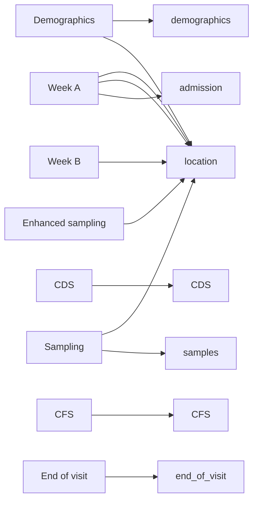

# TRACS database structure and data cleaning strategy

The TRACS database structure reflects the sampling but is probably not ideal for
analysis. The sampling and database structure and how that relates to the data
extraction/cleaning scripts in this repo are described here. Clinical data is
stored in a redcap database and micro data in excel sheets.

## REDCAP

Clinical data is stored in a redcap database.

### REDCAP sampling structure

* Each location (hospital ward or nursing home) is sampled for two weeks; in the
redcap database, this two week period is a redcap event that is referred to as a
"visit"; participants can be sampled in multiple visits if they are still in the
sampling location.
* Each visit incorporates multiple redcap forms
* Participants are consented into the study at a baseline redcap event, which
includes the following forms
    + Demographics
    + Consent info and CONSULT
    + Consent form 
    + Consultee form
* These forms are only completed once , at recruitment
* At each sampling visit, the following forms are completed:
  + Care dependency score
  + Clinical frailty score
  + Antibiotic exposure (one form for each exposure)
  + Week A (which records participant location, whether animal exposure last 3 months (yes/no), PPI use (yes/no), travel
  last 3 months (yes/no)), whether samples collected
  + Week B (location, whether week B samples collected)
  + Sample collection (location, sample ID, sample type)
  + End of visit (date of end of visit, whether participant is still there) -
  this is missing for some of the early participants as we hadn't set the form
  up
* A small number of participants underwent enhanced sampling (sample collection
inbetween visits); they had an extra "Enhanced sampling" event with the forms:
  + enhanced sampling (consent etc)
  + sample collection (sample ID and location)

### Data extraction

The aim is to get the data into a number of long-format tables where each table
tidily reflects one aspect of the study. The scripts generate the following data
tables (right side of diagram below) as CSVs from the recap tables (left side of
diagram below), where the output tables contain the following data:

* Demographics: Patient demographics, proxy measures of SES (last domiciliary
postcode, educational status)
* CDS: Care dependence score and date (can be asked multiple times)
* CFS: Clinical fraily score and date (can be asked multiple times)
* Exposures: Current PPI use, current medical device in situ (catheter etc) travel, animal exposure last 3 months
* Location: Location, date asked
* Sampling: TRACS sample ID, (the unique sample ID that starts TRACS_2, see
below for more details) type of sample
* Admission: Date of admission to current location and where admitted from; can
  be asked multiple times though is only asked once per visit, so some data will
  be repeated here
* Discharge: Date asked, still present in sampling area (yes/no), if no, where
discharged to and date.

## Micro data structure

Microbiology data is stored in a nested directory structure in the TRACS shared
drive. Sample test results are at `location/visit/week/DD.MM.YY TRACS sample
log.xslx`. Naming can change from sheet to sheet. Each spreadsheet has a number
of panes relating to each step of the micro workflow. Samples are tracked across
these panes by the lab team using a lab ID which is an integer starting from 1
at each sampling round - importantly this number is therefore not unique across
different sampling rounds (as it starts again at 1 for each round). The panes
used by the data extraction scripts are:

* Receipt: links TRACS sample ID (the ID that is stuck on the sample tube that
starts TRACS_2 which is a unique ID) to the lab ID
* Plating: has culture results
* qpcr results
* maldi results

MALDI was only done for some samples.

The environmental location data (which links TRACS sample ID to study site
location) is in a separate sheet usually at `location/visit/week/DD.MM.YY
enviornmental samples` or similar. This links the location ID (an integer
starting at 1 for each site, corresponding to the locations shown on the
maps) with the unique TRACS sample ID.

The data extraction scripts (see `README.md`) will pull these data out into two
tables:

* `micro_processed` - sample testing results with unique tracs sample ID (the
one that starts TRACS_2, which links to other tables including the "samples"
table from redcap and the environmental location table below), all the micro
test results and an interpretation of whether e coli is present (`e_coli =
["Yes", "No"]`) or K. pneumo is present (`k_pneumo = ["Yes", "No]`)
* `micro_env_sample_loc` - this links the TRACS sample ID (the TRACS_2 one) to
study location with an ID that corresponds to the location on the maps.

## Data dictionaries

Data dictionaries are in `data/processed/dictionaries`. The script
`R/generate_data_dictionary.R` will generate a summary dictionary for each table
described above. The micro dictionaries include variable descriptions - the
tables derived from redcap don't but the file `TRACSPart2_DataDictionary` file
has the redcap data dictionary which is auto generated.

